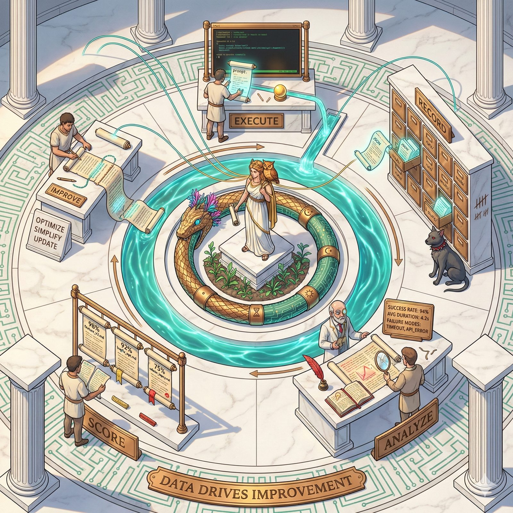

# 🔄 Learning Loop




*The Ouroboros. Half bronze, half circuit board. Every ending feeds the next beginning.*

---

The ouroboros — the serpent eating its own tail — is the oldest symbol of cycles that produce something. Not repetition. Transformation. Where the bronze scales meet the teeth, they become circuit board. Fiber-optic flowers bloom from the bite point. Four rings mark its body: per-run, hourly, daily, weekly. And beneath the serpent, a garden grows, fed by everything it consumes.

That's the Learning Loop. Your agents run. Some succeed. Most fail — at least at first. The serpent eats the failure, digests it, and the next run grows from the remains. Nineteen percent pass rate becomes eighty percent. Not because someone tuned a prompt by hand. Because the system ate its own output and got smarter.

A closed-loop system where every agent run — success or failure — automatically improves future runs.

## The Flywheel

```
Dispatch → Execute → Verify → Record → Analyze → Score → Select → Refine → Dispatch
    ↑                                                                          |
    └──────────────────────────────────────────────────────────────────────────┘
```

## Problem

The agentic coding swarm executes 100+ runs but learns nothing between them. Verification pass rate sits at ~19%. Templates are underused (95/102 runs use `custom`). Failures repeat. This project closes the feedback loop.

## Architecture

Four nested feedback loops at different cadences:

| Loop | Cadence | Script | Purpose |
|------|---------|--------|---------|
| **Run Feedback** | Per-run | `feedback-collector.sh` | Classify outcomes, tag failure patterns |
| **Template Scoring** | Hourly | `score-templates.sh` | Aggregate per-template/agent performance scores |
| **Prompt Refinement** | Daily | `refine-prompts.sh` | Auto-generate improved template variants via A/B testing |
| **Strategy Evolution** | Weekly | `weekly-strategy.sh` | Cross-template learnings and system-level recommendations |

Loop script quick reference:
- `feedback-collector.sh`
- `score-templates.sh`
- `refine-prompts.sh`
- `weekly-strategy.sh`

## Quality Signals

Feedback records include optional qualitative fields for Opus-based judging:

- `opus_quality_score` (0-1)
- `opus_judge` payload (`judge_model`, `style_rating`, `maintainability_rating`, `critique`, `judged_at`)

These fields default to `null` until judge integration is enabled.

Enable sampled judge integration in `feedback-collector.sh` with:

- `JUDGE_ENABLED=true`
- `JUDGE_SAMPLE_RATE=<0..1>`
- `JUDGE_SCRIPT=<path>` (optional override)

## Tech Stack

- **Bash scripts** — all components are standalone bash scripts
- **JSON state files** — reads from `~/.openclaw/workspace/state/`
- **jq** — JSON processing
- **Cron** — scheduled execution

## Project Structure

```
learning-loop/
├── scripts/          # All executable scripts
├── state/            # Runtime state (feedback, scores, reports)
├── config/           # Configuration and schemas
├── PRD_LEARNING_LOOP.md  # Ralph-format PRD with sprints
├── README.md
└── go.mod
```

## Scripts

| Script | Cadence | Purpose |
|--------|---------|---------|
| `scripts/feedback-collector.sh` | Per-run | Classify outcomes, extract signals, detect failure patterns |
| `scripts/opus-judge.sh` | Per-run (sampled) | Produce qualitative quality judgment for completed runs |
| `scripts/detect-patterns.sh` | Per-run | Tag failure patterns, update `state/feedback/pattern-registry.json` |
| `scripts/score-templates.sh` | Hourly (cron) | Aggregate feedback into `state/scores/template-scores.json` and `state/scores/agent-scores.json` |
| `scripts/select-template.sh` | Per-dispatch | Recommend template + agent based on scores and A/B tests |
| `scripts/refine-prompts.sh` | Daily (cron) | Generate template variants from failure data and auto-create A/B tests |
| `scripts/ab-tests.sh` | On-demand | A/B test lifecycle: create, pick, record, evaluate, review queue, approve |
| `scripts/guardrails.sh` | Integrated | Safety: variant limits, rollback, loop breaker |
| `scripts/guardrail-audit.sh` | On-demand | Run guardrail audit and write `state/reports/guardrail-audit-*.json` |
| `scripts/notify.sh` | Integrated | Alerts via wake-gateway (variant events, regressions, weekly report) |
| `scripts/manage-patterns.sh` | On-demand | Pattern registry: list, detail, mitigate, effectiveness |
| `scripts/weekly-strategy.sh` | Weekly (cron) | Cross-cutting strategy report with recommendations |
| `scripts/dashboard.sh` | Hourly (cron) | Generate static HTML dashboard with scores, A/B tests, and recommendations |
| `scripts/backup-state.sh` | Daily (cron) | Backup/restore state archives with retention cleanup |
| `scripts/retrospective.sh` | On-demand | Compare pre-loop vs post-loop metrics, threshold tuning |
| `scripts/backfill.sh` | One-time | Process historical runs through feedback pipeline |
| `scripts/install-cron.sh` | One-time | Install/remove cron entries from `config/crontab.txt` |

See [docs/flywheel.md](docs/flywheel.md) for architecture details, [docs/templates-guide.md](docs/templates-guide.md) for the variant lifecycle, and [docs/opus-judge-spec.md](docs/opus-judge-spec.md) for the Opus judge interface contract.

## Dispatch Integration

Learning Loop is designed to be called from `dispatch.sh` immediately after agent completion (after run/result records are written):

```bash
(cd "$WORKSPACE_ROOT" && WORKSPACE_ROOT="$WORKSPACE_ROOT" \
  "$WORKSPACE_ROOT/tools/learning-loop/scripts/feedback-collector.sh" \
  "state/runs/$BEAD_ID.json") || true
```

- Input passed by dispatch: `state/runs/<bead>.json`
- `feedback-collector.sh` resolves this relative path and writes feedback to:
  - `$FEEDBACK_DIR` (if set), otherwise
  - `$WORKSPACE_ROOT/state/feedback` (when `WORKSPACE_ROOT` is set), otherwise
  - `learning-loop/state/feedback`
- Hook is intentionally non-blocking (`|| true`) so dispatch completion is never blocked by feedback processing.

## Goal

Within 50 runs of activation, achieve ≥80% verification-pass rate (up from ~19%).

## Status

See [PRD_LEARNING_LOOP.md](PRD_LEARNING_LOOP.md) for sprint breakdown and task tracking.

## Dependencies

### Beads (bd CLI)

Learning Loop integrates with beads for tracking feedback items and improvement tasks.

- Required version: **0.46.0**
- Fork: [Perttulands/beads](https://github.com/Perttulands/beads) (branch `v0.46.0-stable`)
- Install: `go install github.com/Perttulands/beads/cmd/bd@v0.46.0`
- Verify: `bd --version` should show `bd version 0.46.0`

## Refinement Gating

- `NO_AUTO_PROMOTE` defaults to `true` in `config/env.sh`.
- When a variant wins evaluation, it is queued in `state/scores/promotion-review-queue.json`.
- Use `scripts/ab-tests.sh review-queue` and `scripts/ab-tests.sh approve <template>` for human-gated promotion.

## Part of the Agora

Learning Loop was forged in **[Athena's Agora](https://github.com/Perttulands/athena-workspace)** — an autonomous coding system where AI agents build software and a bronze serpent makes sure they learn from every failure.

[Argus](https://github.com/Perttulands/argus) watches the server. [Truthsayer](https://github.com/Perttulands/truthsayer) watches the code. [Oathkeeper](https://github.com/Perttulands/oathkeeper) watches the promises. [Relay](https://github.com/Perttulands/relay) carries the messages. The Ouroboros eats the output and grows the garden.

The [mythology](https://github.com/Perttulands/athena-workspace/blob/main/mythology.md) has the full story.

## License

MIT
