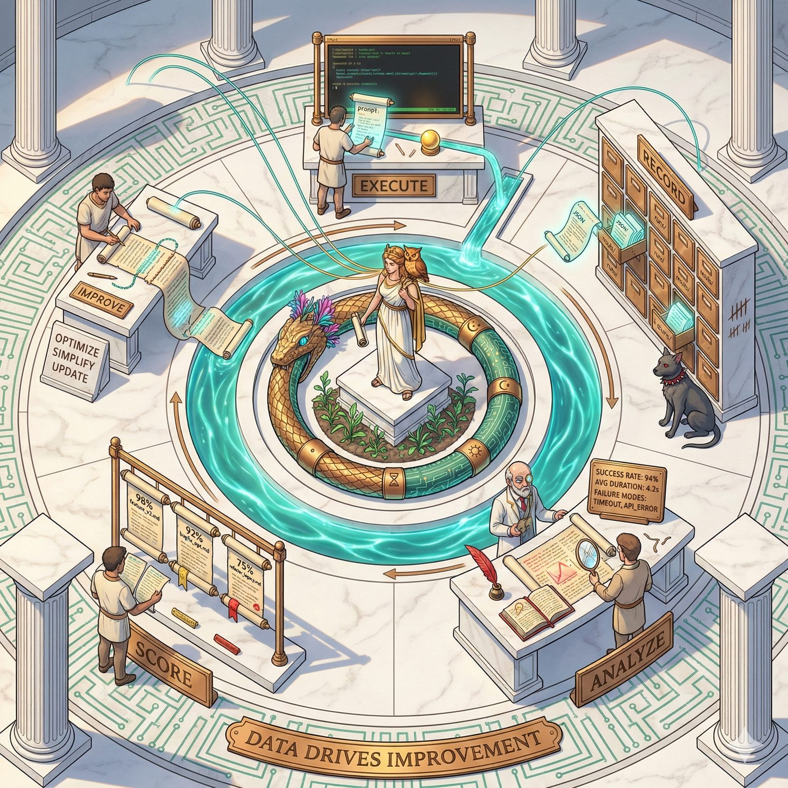

# Learning Loop




*The Ouroboros. Half bronze, half circuit board. Every ending feeds the next beginning.*

---

Every AI agent run produces signal — what worked, what failed, how long it took, what files it touched. Almost all of that signal evaporates the moment the run ends. The next agent starts from scratch, makes the same mistakes, and nobody learns anything.

Learning Loop is the fix. It's a single Go binary backed by SQLite that ingests run records, detects failure patterns, and feeds that knowledge back into future runs. You call `loop ingest` when a run finishes, `loop query` before the next one starts, and the system gets smarter without you touching a prompt. On top of the binary sits a shell-scripts layer that handles the full flywheel: template scoring, A/B testing, automated refinement, cron-driven analysis, and a static HTML dashboard.

---

The ouroboros — the serpent eating its own tail — is the oldest symbol of cycles that produce something. Not repetition. Transformation. Where the bronze scales meet the teeth, they become circuit board. Fiber-optic flowers bloom from the bite point. Four rings mark its body: per-run, hourly, daily, weekly. And beneath the serpent, a garden grows, fed by everything it consumes.

That's the Learning Loop. Your agents run. Some succeed. Most fail — at least at first. The serpent eats the failure, digests it, and the next run grows from the remains. Nineteen percent pass rate becomes eighty percent. Not because someone tuned a prompt by hand. Because the system ate its own output and got smarter.

---

```
$ loop query "fix authentication middleware"

 LEARNINGS  From 23 similar runs (78% success rate)

  1. Always run the full test suite before committing — 34% of auth
     bug fixes failed because tests were skipped.

  2. Auth middleware changes typically touch 2-4 files. If you're
     editing more than 5, you're probably scope-creeping.

 WATCH OUT  Patterns that caused failures in similar tasks

  ● tests-skipped          12 occurrences   HIGH impact
  ● scope-creep             4 occurrences   MEDIUM impact

 SUCCESS SIGNALS  What winning runs looked like

  ✓ Edited test files alongside source     → 92% success rate
  ✓ Completed in under 10 minutes          → 85% success rate
```

## The Flywheel

```
Dispatch → Execute → Verify → Record → Analyze → Score → Select → Refine → Dispatch
    ↑                                                                          |
    └──────────────────────────────────────────────────────────────────────────┘
```

The Go binary (`loop`) handles the inner cycle: ingest, query, analyze. The shell scripts handle the outer cycle: scoring templates, selecting the best agent+template pair for a task, refining underperformers, and running A/B tests to validate changes.

## Current Status

**Core binary (Go):**
- ✅ `loop init` — creates SQLite database
- ✅ `loop ingest` — parses run JSON, detects 8 patterns, stores everything
- ✅ `loop query` — relevance-matched learnings with `--inject` for prompt injection
- ✅ `loop analyze` — aggregation, clustering, insight generation
- ✅ `loop status`, `patterns`, `insights`, `runs`, `report` — all working with `--json` output
- ✅ Single binary, zero runtime dependencies, v0.1.0

**Scripts layer (bash + jq):**
- ✅ Feedback collection, pattern detection, template scoring
- ✅ A/B test lifecycle (create, pick, record, evaluate, approve)
- ✅ Guardrails (variant caps, rollback, loop breaker)
- ✅ Weekly strategy reports, dashboard generation, backup/restore
- ✅ Cron integration for hourly/daily/weekly automation
- ⚠️ `config/env.sh` paths still reference old workspace layout — needs update for your environment
- ⚠️ No integration wired to `ergon` (work orchestration) yet — ingestion is manual
- ⚠️ Opus judge script (`scripts/opus-judge.sh`) requires external API access

## Install

```bash
go install github.com/Perttulands/learning-loop/cmd/loop@latest
```

Or grab the pre-built binary from the repo root.

## Quick Start

```bash
# Initialize (creates .learning-loop/loop.db)
loop init

# After an agent run, ingest the result
loop ingest run.json

# Or pipe from stdin
echo '{"id":"run-1","task":"Fix login bug","outcome":"success","tests_passed":true}' | loop ingest -

# Before the next run, ask what the agent should know
loop query "fix authentication bug"

# See what the system has learned
loop status
loop patterns
loop insights
```

## Architecture

```
                     ┌──────────────────────────────────────────┐
                     │             loop CLI                     │
                     │                                          │
 Agent finishes ───► │  ingest   Parse → Detect → Store         │
                     │                                          │
 Agent starting ───► │  query    Match → Rank → Format          │
                     │                                          │
 Cron / manual ────► │  analyze  Aggregate → Cluster → Insight  │
                     │                                          │
 Human ────────────► │  status · patterns · insights · runs     │
                     └──────────────────┬───────────────────────┘
                                        │
                                        ▼
                             ┌────────────────────┐
                             │  SQLite (embedded)  │
                             │  Zero dependencies  │
                             │  Single file DB     │
                             └────────────────────┘
```

## CLI Reference

**Global flag:** `--db <path>` — override database path (default: `.learning-loop/loop.db`)

```
loop init                         Initialize database
loop ingest <file|->              Ingest a run record (file path or - for stdin)
loop query <description>          Get relevant learnings for a task
loop query --inject               Output as injectable context block for prompts
loop query --json                 Machine-readable output
loop query --max <n>              Max runs to consider (default: 10)
loop analyze                      Run analysis on new (unanalyzed) data
loop analyze --json               Machine-readable analysis output
loop status                       Dashboard: runs, patterns, health
loop status --json                Machine-readable status
loop patterns                     List detected patterns with stats
loop patterns --json              Machine-readable patterns
loop insights                     Show active insights
loop insights --json              Machine-readable insights
loop insights --tags <csv>        Filter by tags (OR logic)
loop runs                         List recent runs with outcomes
loop runs --last <n>              Limit to last N runs (default: 20)
loop runs --outcome <value>       Filter by outcome (success|failure|partial|error)
loop runs --json                  Machine-readable runs
loop report                       Generate full summary report
loop report --json                Machine-readable report
loop version                      Print version (v0.1.0)
```

## Scripts Layer

Beyond the Go binary, the `scripts/` directory contains the full flywheel automation:

| Script | Purpose |
|--------|---------|
| `feedback-collector.sh` | Classify run outcomes, extract signals, write feedback records |
| `opus-judge.sh` | Qualitative Opus-style quality assessment for a run |
| `detect-patterns.sh` | Detect failure patterns from run records, update registry |
| `score-templates.sh` | Aggregate feedback into template and agent scores |
| `select-template.sh` | Recommend template + agent pair for a task description |
| `refine-prompts.sh` | Generate improved template variants from failure data |
| `ab-tests.sh` | A/B test lifecycle: create, pick, record, evaluate, approve |
| `guardrails.sh` | Safety limits: variant caps, rollback, loop breaker |
| `weekly-strategy.sh` | Weekly cross-cutting strategy report |
| `dashboard.sh` | Generate static HTML dashboard |
| `backup-state.sh` | Backup/restore state with retention policy |
| `install-cron.sh` | Install/remove cron entries for scheduled execution |

Cron schedule: scoring hourly, refinement daily at 03:00 UTC, strategy weekly on Sundays.

## Run Record Format

```json
{
  "id": "run-a8f3e",
  "task": "Fix authentication bug in login middleware",
  "outcome": "success",
  "duration_seconds": 342,
  "timestamp": "2026-02-22T14:30:00Z",
  "tools_used": ["read", "edit", "bash"],
  "files_touched": ["src/auth/middleware.go", "src/auth/middleware_test.go"],
  "tests_passed": true,
  "lint_passed": true,
  "tags": ["auth", "bug-fix"],
  "agent": "claude-code",
  "model": "claude-opus-4-6"
}
```

Only `id`, `task`, and `outcome` are required. Allowed outcomes: `success`, `partial`, `failure`, `error`. Missing `timestamp` is auto-filled to current UTC.

## Pattern Detection

8 patterns detected automatically on every ingest:

| Pattern | Condition | Impact |
|---------|-----------|--------|
| `tests-skipped` | Non-success outcome with no `tests_passed` field | HIGH |
| `tests-failed` | `tests_passed == false` | HIGH |
| `lint-failed` | `lint_passed == false` | MEDIUM |
| `scope-creep` | `duration_seconds > 1800` or more than 8 files touched | MEDIUM |
| `quick-failure` | Failed in under 60 seconds | HIGH |
| `long-running` | `duration_seconds > 3600` | MEDIUM |
| `no-test-files` | Source files modified but no test file marker in `files_touched` | MEDIUM |
| `success-with-errors` | Outcome is `success` but `error_message` is non-empty | MEDIUM |

## Query Matching

Relevance scoring uses:
1. **Tag overlap** between query terms and run tags
2. **Keyword similarity** between task descriptions
3. **File references** mentioned in the query
4. **Recency decay** — recent runs weighted higher
5. **Outcome signal** — failures with patterns are most informative

## Analysis Engine

Run `loop analyze` to process new (unanalyzed) runs and generate insights. Insights are created when a pattern appears 3 or more times. Confidence scales with frequency: 0.5 (< 5 occurrences), 0.75 (≥ 5), 0.9 (≥ 10). A global success-rate insight is added once 5 or more total runs exist.

## File Layout

```
learning-loop/
├── loop                      Pre-built binary (v0.1.0)
├── cmd/loop/main.go          CLI entrypoint (Go source)
├── internal/
│   ├── db/                   SQLite layer (connection, CRUD, migrations)
│   ├── ingest/               Run parsing, validation, pattern detection
│   ├── analyze/              Aggregation, clustering, insight generation
│   ├── query/                Relevance matching, result formatting
│   └── report/               Report generation
├── scripts/                  Flywheel automation (bash + jq)
├── config/                   Environment config, cron templates, schemas
├── state/                    Runtime state (scores, feedback, reports)
├── tests/                    Shell script test suite
├── e2e_test.go               End-to-end test suite (Go)
├── city.toml                 City-readiness contract
├── go.mod
└── README.md
```

## Part of Polis

Learning Loop is the memory of the system. It lives inside Polis — a multi-agent platform where AI agents build software and a bronze serpent makes sure they learn from every failure.

Sibling tools in the ecosystem:

| Tool | Repo | Role |
|------|------|------|
| Ergon | [ergon-work-orchestration](https://github.com/Perttulands/ergon-work-orchestration) | Work dispatch and orchestration |
| Hermes | [hermes-relay](https://github.com/Perttulands/hermes-relay) | Message relay between agents |
| Cerberus | [cerberus-gate](https://github.com/Perttulands/cerberus-gate) | Access control gate |
| Chiron | [chiron-trainer](https://github.com/Perttulands/chiron-trainer) | Agent training framework |
| Senate | [senate](https://github.com/Perttulands/senate) | Multi-agent deliberation |
| Beads | [beads-polis](https://github.com/Perttulands/beads-polis) | Trace and provenance |
| Truthsayer | [truthsayer](https://github.com/Perttulands/truthsayer) | Code quality verification |
| Horkos | [horkos-oathkeeper](https://github.com/Perttulands/horkos-oathkeeper) | Contract enforcement |
| Argus | [argus-watcher](https://github.com/Perttulands/argus-watcher) | Infrastructure monitoring |
| UBS | [ultimate_bug_scanner](https://github.com/Perttulands/ultimate_bug_scanner) | Bug detection |
| Utils | [polis-utils](https://github.com/Perttulands/polis-utils) | Shared utilities |

The [mythology](https://github.com/Perttulands/athena-workspace/blob/main/mythology.md) has the full story.

## License

MIT
